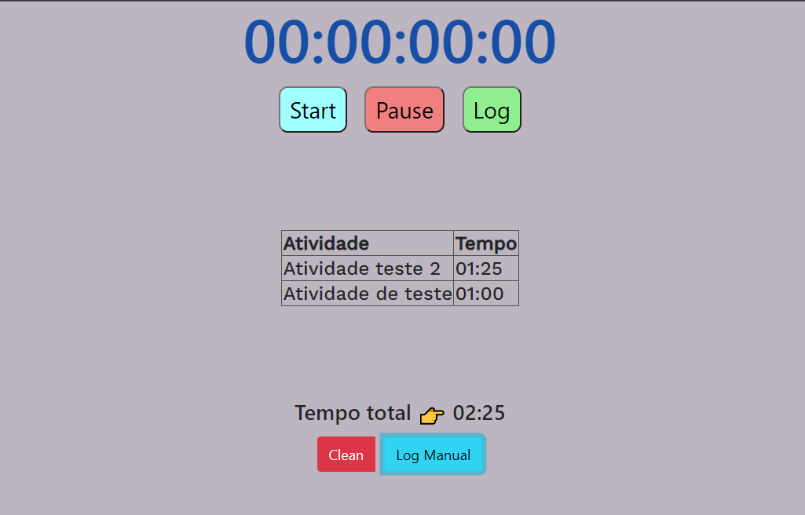
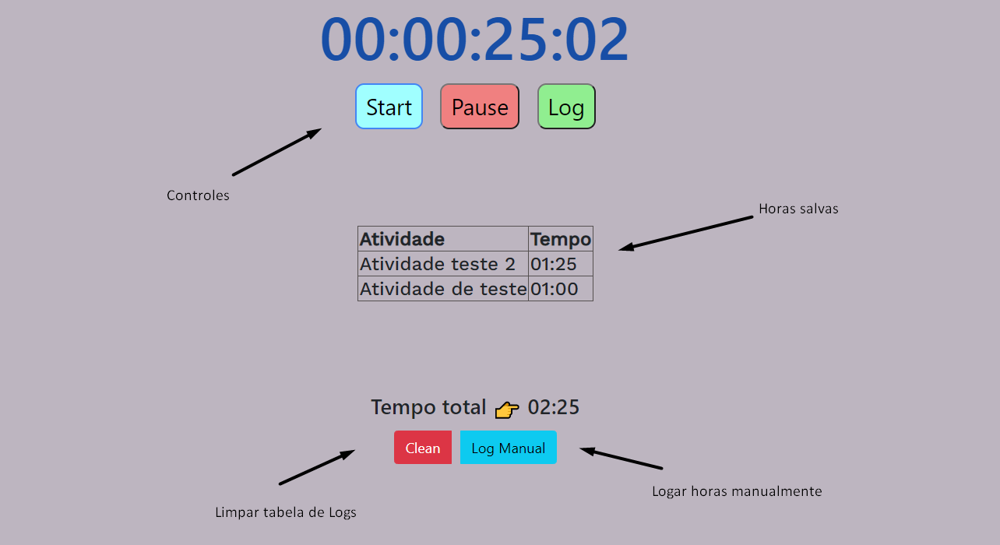

# web_stopwatch_work

Cronômetro web para logar (salvar) suas horas de trabalho.

## Demonstração

## Uso/Exemplos

## Acesso

A página está publicada em http://timer.techgenial.com.br

## Stack utilizada

**Front-end:** HTML, CSS

**Back-end:** Javascript
